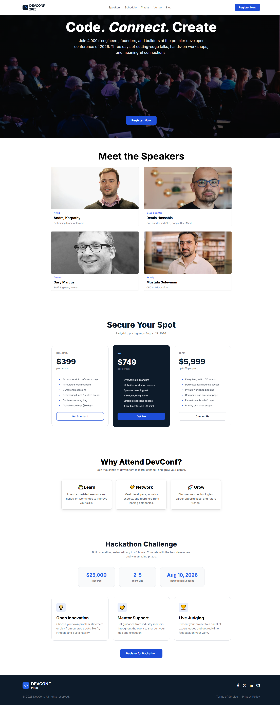

# 🚀 DevConf 2026

A modern and responsive conference landing page built with **HTML5** and **CSS3**. This project showcases a clean UI, structured layouts, reusable components, and responsive design principles.

---

## 🌐 Live Demo

🔗 https://aminulislam424842.github.io/Assignment1/

## 📂 GitHub Repository

🔗 https://github.com/aminulislam424842/Assignment1

---

# 📸 Full Website Preview



---

# ✨ Features

- Responsive Navigation Bar
- Modern Hero Section
- Speakers Showcase
- Pricing Cards
- Why Attend Section
- Hackathon Challenge Section
- Professional Footer
- Clean HTML Structure
- Reusable CSS Components
- Modern UI Design

---

# 🛠️ Technologies Used

- HTML5
- CSS3
- Flexbox
- CSS Grid
- Font Awesome
- Google Fonts (Inter)

---

# 📑 Website Sections

---

## 1️⃣ Navigation Bar

### Features

- Fixed Navigation
- Conference Logo
- Navigation Links
- Register Button

### Preview


---

## 2️⃣ Hero Section

### Features

- Fullscreen Banner
- Background Image
- Gradient Overlay
- Call To Action Button

### Preview


---

## 3️⃣ Speakers Section

### Features

- Grid Layout
- Speaker Cards
- Speaker Image
- Speaker Role
- Company Information

### Preview


---

## 4️⃣ Pricing Section

### Features

- Three Pricing Plans
- Highlighted Pro Plan
- Feature Lists
- CTA Buttons

### Preview


---

## 5️⃣ Why Attend Section

### Features

- Learn
- Network
- Grow
- Informative Cards

### Preview


---

## 6️⃣ Hackathon Challenge

### Features

- Prize Pool
- Team Size
- Registration Deadline
- Mentor Support
- Innovation Tracks
- Live Judging
- Registration Button

### Preview


---

## 7️⃣ Footer

### Features

- Conference Branding
- Social Media Icons
- Copyright
- Terms & Privacy Links

### Preview


---
# 📁 Folder Structure

```text
Assignment-01/
│
├── Analysis/
│   ├── Screenshot 2026-07-10 151518.png
│   ├── Screenshot 2026-07-10 152251.png
│   ├── Screenshot 2026-07-10 153110.png
│   ├── Screenshot 2026-07-10 154324.png
│   ├── Screenshot 2026-07-10 154931.png
│   └── Screenshot 2026-07-10 155244.png
│
├── assets/
│   ├── andrej.png
│   ├── banner.jpg
│   ├── demis.png
│   ├── footer-logo.png
│   ├── gary.png
│   ├── logo-mini.png
│   ├── logo.png
│   └── mustafa.png
│
├── preview/
│   ├── aminulislam424842.github.io_Assignment1_.png
│   ├── Screenshot 2026-07-10 165039.png
│   ├── Screenshot 2026-07-10 165108.png
│   ├── Screenshot 2026-07-10 165131.png
│   ├── Screenshot 2026-07-10 165143.png
│   ├── Screenshot 2026-07-10 165201.png
│   ├── Screenshot 2026-07-10 165237.png
│   └── Screenshot 2026-07-10 165255.png
│
├── ui/
│   └── DevConf 2026 Landing Page.png
│
├── index.html
├── style.css
├── prompt.md
└── README.md
```


---

# 🎨 Color Palette

| Color | Hex Code | Usage |
| :----- | :------- | :---- |
| Primary Blue | `#1D4ED8` | Primary buttons, CTA, Pricing actions |
| Accent Blue | `#2563EB` | Statistics, Hover effects, Icon backgrounds |
| Dark Navy | `#0D1B2A` | Footer, Pro pricing card, Section headings |
| White | `#FFFFFF` | Backgrounds, Button text, Hero heading |
| Charcoal | `#111827` | Main headings, Navigation hover |
| Dark Gray | `#374151` | Pricing feature list |
| Medium Gray | `#575757` | Navigation links, Subtitles |
| Gray | `#6B7280` | Body text, Footer text |
| Light Gray | `#E5E7EB` | Borders, Dividers |
| Background Gray | `#F9FAFB` | Statistics cards |
| Light Blue | `#93C5FD` | Pro plan label |

---

### Transparency Colors

| Color | Usage |
| :---- | :---- |
| `rgba(0, 0, 0, 0.55)` | Hero background overlay |
| `rgba(255, 255, 255, 0.90)` | Hero description text |
| `rgba(255, 255, 255, 0.15)` | Pro card divider |
| `rgba(37, 99, 235, 0.10)` | Feature icon background |
| `rgba(5, 48, 238, 0.76)` | Social icon hover |
| `rgba(0, 0, 0, 0.08)` | Card shadow |

---

# 📱 Responsive Design

- Desktop
- Laptop
- Tablet (Can be extended)
- Mobile (Can be extended)

---

# 🚀 Getting Started

```bash
git clone https://github.com/aminulislam424842/Assignment1.git
```

Open

```
index.html
```

using your browser.

---

# 👨‍💻 Author

**Aminul Islam**

Frontend Developer

---

# ⭐ Support

If you like this project, don't forget to give it a ⭐ on GitHub.